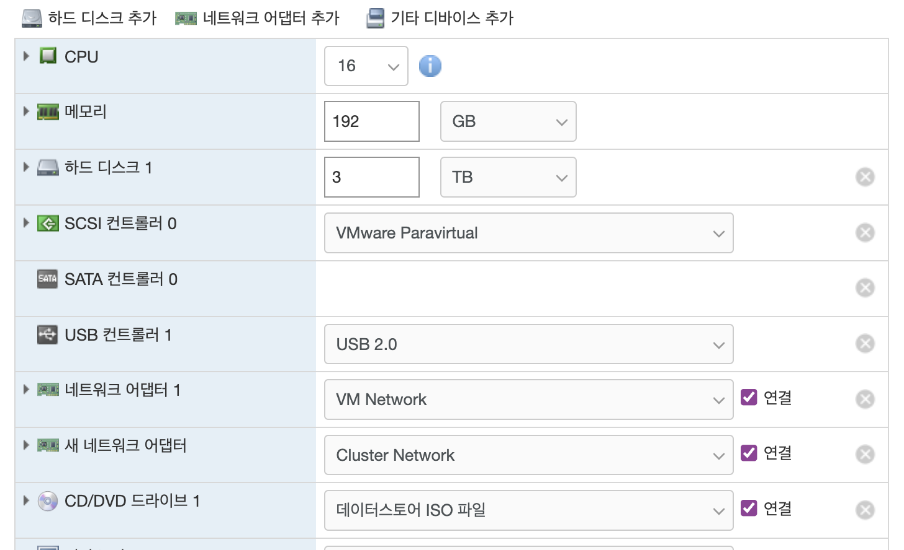
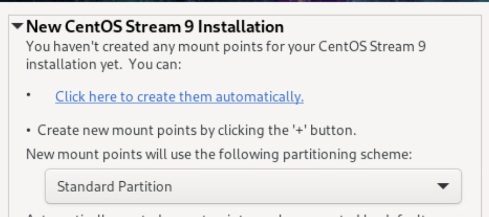
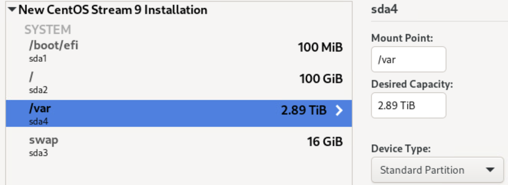
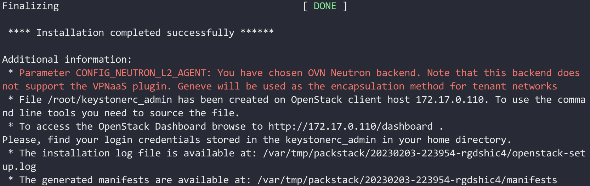

## Preparation
- 3 vm machines, which are based on VMware ESXi (They can be replaced by physical machines)
- If you use VMware ESXi, accept the ```Promiscuous mode``` from the vSwitchX

> - first vm machine -> controller node + network node
> - second vm machine -> compute node + network node
> - third vm machine -> compute node + network node

</img>

## Install CentOS Stream 9
- select disk custom partition
(Change partitioning scheme LVM --> standard partition)

</img>
</img>
```
/boot/efi 1 GiB
swap      30 GiB
/         100 GiB
/var      (most)             // openstack vm instacnes here
```

## Enable root login over SSH
```
vi /etc/ssh/sshd_config
...
#LoginGraceTime 2m
PermitRootLogin yes
#StrictModes yes
...

service sshd restart
```

## Modify centos repo

```
vi /etc/yum.repos.d/centos.repo
(comment out metalink, and add baseurl)

[baseos]
#metalink=https://mirrors.centos.org/metalink?repo=centos-baseos-$stream&arch=$basearch&protocol=https,http
baseurl=https://mirror.stream.centos.org/9-stream/BaseOS/$basearch/os/

[appstream]
#metalink=https://mirrors.centos.org/metalink?repo=centos-appstream-$stream&arch=$basearch&protocol=https,http
baseurl=https://mirror.stream.centos.org/9-stream/AppStream/$basearch/os/

[crb]
#metalink=https://mirrors.centos.org/metalink?repo=centos-crb-$stream&arch=$basearch&protocol=https,http
baseurl=https://mirror.stream.centos.org/9-stream/CRB/$basearch/os/
```
** [additional] https://algo79.tistory.com/883 **

## Make sure /etc/environment
```
vi /etc/environment
LANG=en_US.UTF-8
LC_ALL=en_US.UTF-8
```

## Disable the selinux
```
sed -i 's/=enforcing/=disabled/g' /etc/selinux/config
setenforce 0
```

## Install centos-release-openstack-zed
```
dnf update -y
dnf config-manager --enable crb
dnf install -y centos-release-openstack-zed
dnf update -y
dnf install -y openstack-packstack
```

## Install network-relevant things
- Install ovs
```
dnf install network-scripts -y
dnf install -y openvswitch
```

- Run the following commands
```
systemctl disable firewalld
systemctl stop firewalld
systemctl disable NetworkManager
systemctl stop NetworkManager
systemctl enable network
```

## Change ifname to ethX (if needed)
```
vi /etc/default/grub
...
GRUB_CMDLINE_LINUX="crashkernel=auto resume=/dev/mapper/cl-swap rd.lvm.lv=cl/root rd.lvm.lv=cl/swap net.ifnames=0 rhgb quiet"
...

grub2-mkconfig  -o /boot/grub2/grub.cfg
```

* mapping interface to mac addr
```
vi /etc/udev/rules.d/70-persistent-ipoib.rules
SUBSYSTEM=="net", ACTION=="add", DRIVERS=="?*", ATTR{address}=="bc:5f:f4:93:d6:ed", ATTR{type}=="1", KERNEL=="eth*", NAME="eth10"
```


## Make interface script files

(External)
- Make ```/etc/sysconfig/network-scripts/ifcfg-br-ex``` resemble:
```
DEVICE=br-ex
DEVICETYPE=ovs
TYPE=OVSBridge
BOOTPROTO=static
IPADDR=[External ip]
NETMASK=[External netmask]
GATEWAY=[External gw]
DNS1=168.126.63.1
ONBOOT=yes
```

- Make ```/etc/sysconfig/network-scripts/ifcfg-[external if]``` resemble (no BOOTPROTO!):
```
DEVICE=[external if]
TYPE=OVSPort
DEVICETYPE=ovs
OVS_BRIDGE=br-ex
ONBOOT=yes
```

(Optional - VPN)
- Make ```/etc/sysconfig/network-scripts/ifcfg-br-vpn``` resemble:
```
DEVICE=br-vpn
DEVICETYPE=ovs
TYPE=OVSBridge
BOOTPROTO=static
IPADDR=[vpn ip]
NETMASK=[vpn netmask]
#GATEWAY=[vpn gw]
#DNS1=168.126.63.1
ONBOOT=yes
```
- Make ```/etc/sysconfig/network-scripts/ifcfg-[vpn if]``` resemble (no BOOTPROTO!):
```
DEVICE=[vpn if]
TYPE=OVSPort
DEVICETYPE=ovs
OVS_BRIDGE=br-vpn
ONBOOT=yes
```

(Internal)
- Make ```/etc/sysconfig/network-scripts/ifcfg-[internal if]```
```
DEVICE=[internal if]
BOOTPROTO=static
IPADDR=[internal ip] # 10.0.0.41
NETMASK=255.255.255.0
ONBOOT=yes
```


## Change the hostname - controller, compute1, compute2, ... (if needed)
```
hostnamectl set-hostname controller
```

- set ```/etc/hosts```
```
vi /etc/hosts
172.17.0.113 controller
172.17.0.114 compute
172.17.0.115 network
```

## Enable ssh login without entering password (From now on, it should be executed on the controller node only)
```
su -
ssh-keygen
ssh-copy-id root@controller [and ip]
ssh-copy-id root@compute1 [and ip]
ssh-copy-id root@compute2 [and ip]
```

- Reboot system
```
reboot
```

- Generate packstack configuration file and edit it
```
packstack --gen-answer-file=packstack.cfg 
```
- Configure the answer file
```
  25 CONFIG_CINDER_INSTALL=n
  41 CONFIG_SWIFT_INSTALL=n
  46 CONFIG_CEILOMETER_INSTALL=n
  50 CONFIG_AODH_INSTALL=n
  
  76 CONFIG_NTP_SERVERS=time.bora.net
  
  91 CONFIG_CONTROLLER_HOST=172.17.0.110
  94 CONFIG_COMPUTE_HOSTS=172.17.0.111,172.17.0.112
  98 CONFIG_NETWORK_HOSTS=172.17.0.110,172.17.0.111,172.17.0.112

  240 CONFIG_SSL_CERT_DIR=~/packstack/
  247 CONFIG_SSL_CERT_SUBJECT_C=KR
  250 CONFIG_SSL_CERT_SUBJECT_ST=--
  253 CONFIG_SSL_CERT_SUBJECT_L=Incheon
  256 CONFIG_SSL_CERT_SUBJECT_O=Incheon-National-University
  259 CONFIG_SSL_CERT_SUBJECT_OU=CCLab
  259 CONFIG_SSL_CERT_SUBJECT_CN=CCLab
  259 CONFIG_SSL_CERT_SUBJECT_MAIL=cclabadmin@cclab-inu.com

  313 CONFIG_KEYSTONE_ADMIN_EMAIL=cclabadmin@cclab-inu.com

  750 CONFIG_NEUTRON_ML2_TYPE_DRIVERS=flat,vxlan
  
  756 CONFIG_NEUTRON_ML2_TENANT_NETWORK_TYPES=vxlan

  865 CONFIG_NEUTRON_OVN_BRIDGE_MAPPINGS=extnet:br-ex,vpnnet:br-vpn
  
  899 CONFIG_NEUTRON_OVN_TUNNEL_IF=eth12
  
  1137 CONFIG_PROVISION_DEMO=n
```

- Install Tmux 
```
dnf install tmux -y
```

- Install OpenStack
```
packstack --answer-file=packstack.cfg
```
</img>

get cirros image

```
curl -L http://download.cirros-cloud.net/0.3.4/cirros-0.3.4-x86_64-disk.img | glance \
         image-create --name='cirros image' --visibility=public --container-format=bare --disk-format=qcow2
```

### References
- https://www.rdoproject.org/install/packstack/
- https://ssup2.github.io/theory_analysis/OpenStack_Network_Neutron/
- https://it-hangil.tistory.com/34
- https://yoonsu.tistory.com/3
